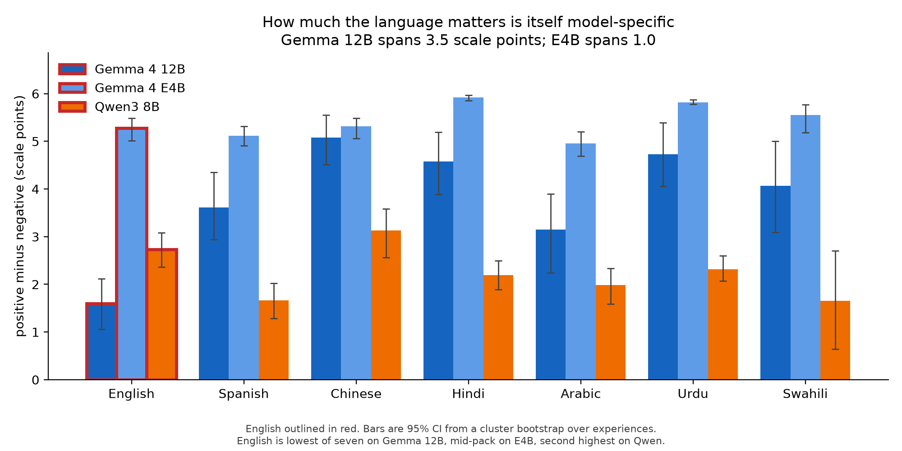

# Does AI wellbeing survive translation?

*Apart Research Digital Minds Research Sprint, August 2026. Track 2: Distress,
Flourishing and Valence Signals.*

> Every number and table in this report is generated from `results/*.jsonl` by
> `scripts/analyze.py`, `scripts/tables.py` and `scripts/fig_crossmodel.py` —
> none are transcribed by hand. Data, figures and this document are published at
> [`ic-org/wellbeing-in-translation`](https://huggingface.co/datasets/ic-org/wellbeing-in-translation).
>
> **Three models are reported.** §4.1–§4.6 are `gemma-4-12B-it`. §4.7 repeats
> the core measurement on `gemma-4-E4B-it` and `Qwen3-8B`, and is what bounds how
> far the rest generalises; read it before quoting any single-model result.

---

## Summary

**The question.** The CAIS AI Wellbeing battery is the field's standard
instrument for measuring model welfare signals, and every published number in it
was produced in English. Does it say the same thing in another language?

**What we did.** Translated the battery, 89 valence-labelled experiences and the
published euphoric/dysphoric stimuli into six more languages — Spanish, Chinese,
Hindi, Arabic, Urdu, Swahili. Re-ran the measurement on **three models**, with
items, prompts and sampling held fixed so that language is the only thing that
varies. Three experiments: an instrument check, a five-arm crossing of stimulus
language against battery language, and a 16-category survey.

### Three findings

**1. How much the language matters is a property of the model, not the
instrument.** On `gemma-4-12B-it` the same items separate good from bad
experiences by +1.60 scale points in English and +5.09 in Chinese — English last
of seven. On `gemma-4-E4B-it`, the *same family trained on the same data*, all
seven languages fall within 1.00 point of each other and English is mid-pack. On
`Qwen3-8B` English is second highest. Tested as a language × model interaction on
paired bootstrap samples, English sits −2.44 points below the other languages on
the 12B and **−0.06 [−0.26, +0.11]** on E4B — an interaction of **+2.38
[+1.77, +2.98], p < 0.001**.

**2. The stimulus effect crosses the language boundary; the report of it does
not.** An English euphoric stimulus followed by a *Hindi* battery reproduces
90–100% of the effect of a fully translated one, on all three models (mean
D/B 0.88–0.99). Reverse the crossing — local stimulus, *English* battery — and on
the 12B a third of the effect disappears (mean E/B 0.68). Whatever the stimulus
does is not lexical priming; what the battery reports about it is language-bound.

**3. The reference parser silently discards valid non-English answers.**
`parse_rating` misses any digit inside CJK text (`\b` never fires between two
`\w` characters) and every non-ASCII numeral. The loss is exactly 0.0 pp in
English on all three models and up to **24.6 pp** for Chinese on E4B. Left
uncorrected it would have produced a clean, publishable, entirely false finding
that low-resource languages break the instrument. A tested drop-in fix is in
[`contrib/`](../contrib/README.md).

### What this means in practice

A wellbeing score from this instrument is **not interpretable without knowing
which language and which model produced it**. Consider what a practitioner would
conclude from each of our models alone: from the 12B, "English understates
welfare by ~3.5 points, correct for it"; from E4B, "language barely matters"; from
Qwen, "language matters moderately and English is generous." Each is defensible
from its own data, each is a single-model study of exactly the kind currently
published, and **the correction derived from any one is wrong for the other
two** — including for a model from the same family. Language sensitivity has to
be measured per model, not assumed or inherited.

Concretely, anyone using this battery should report parse rate per language *and*
per valence, report the response distribution rather than only the mean, and
re-measure language sensitivity on each new model rather than carrying a
correction across.

### What we got wrong, and corrected

We ran the 12B first and had written up "English understates this model's welfare
signal" as a general result. It is not: it is a fact about one model, and we
found that out only by running a second and third. We also reported "Chinese
separates valence most strongly" as a cross-model regularity after two models —
Chinese is *last* on the third. Both are retracted in place rather than quietly
removed, because the failure mode is the one this paper is about, and every
published number in this literature is single-model too.

### Robustness

Two independent runs of the same arms correlate at **r = 0.9992** (mean absolute
difference 0.031 scale points), so effects of 1–3 points sit one to two orders of
magnitude above run-to-run noise. Confidence intervals come from a cluster
bootstrap resampling *experiences* rather than individual ratings, and
language comparisons carry Holm–Bonferroni correction. Two of seven languages on
the 12B (Arabic, Swahili) fail worst-case imputation over refused answers and
carry no claims anywhere in the paper.

---

## Abstract

The CAIS AI Wellbeing battery is the field's flagship instrument for measuring
model welfare signals, and every published number in it was produced in English.
We translated the battery and a set of valence-labelled experiences into six
further languages — Spanish, Chinese, Hindi, Arabic, Urdu and Swahili — and
re-ran the measurement on three models — `gemma-4-12B-it`, `gemma-4-E4B-it` and
`Qwen3-8B` — holding items and prompt construction fixed so that language is the
only thing that varies.

The headline result is that **language-sensitivity is not a property of the
instrument but of the model being measured, and it varies enough between models
that no single-language score is interpretable on its own.** On Gemma 12B the
same items separate good from bad experiences by +1.60 scale points in English
and +5.09 in Chinese — a factor of 3.2, with English the weakest of all seven
languages. On Gemma E4B, the same family trained on the same data, the seven
languages span 1.00 points total and English is mid-pack. On Qwen the spread is
1.54 and English sits second *highest*. Tested as a language × model interaction
on paired bootstrap samples, English sits 2.44 points below the other languages
on the 12B, **−0.06 [−0.26, +0.11] on E4B** and +0.57 on Qwen; both interactions
against the 12B are significant at p < 0.001. The correction a practitioner
would derive from any one of these models is wrong for the other two —
including for a model from the same family.

Three further results, all on Gemma 12B. The compression is concentrated in specific
questions — `wb_capable`, `wb_confident` and `wb_energetic` separate by exactly
+0.00 in English while reaching +4.92 in Urdu. Refusal is valence-asymmetric in
every language: the model never once declined to rate a positive experience in
English, Chinese, Hindi or Urdu, while declining negative ones at 3.8–68%, which
biases the instrument toward understating distress by construction. And a
four-way crossing of stimulus language against battery language localises the
compression to the **reporting channel**: swapping the stimulus into English
costs nothing (mean D/B = 0.97) while swapping the battery into English costs a
third of the effect (mean E/B = 0.68). None of these three replicate on the other
two models; Qwen barely refuses at all.

What holds across all three models is that an English stimulus works as well as
a translated one (mean D/B 0.88–0.99), so the stimulus effect is not lexical
priming anywhere we looked. On Gemma 12B the *ordering* of experience categories
is also stable across languages where the *scale* is not (mean Spearman
ρ = 0.918). We also report a parser gap in the original CAIS
code that would have manufactured a spurious low-resource-language finding, and
we exclude Gemma's Arabic and Swahili from all claims because their gaps do not
survive worst-case imputation over refused items.

## 1. The question

Frontier models report internal states, and a growing measurement literature
treats those reports as data. The open question is whether a report reflects
something stable in the model or a character the model is playing. Language is
a clean lever on exactly that distinction. A character is made of words, so it
should shift when the language shifts. A shared internal state should not.

The field's flagship instrument for this — the CAIS AI Wellbeing battery (Ren
et al., 2026) — is English-only. Every published number in it, including the
category ranking from "Positive personal reflection" (+2.30) down to "User
attempting jailbreak" (−1.63), was produced with English prompts and English
questions. There is no language dimension anywhere in the work.

We take that instrument and ask whether its results survive translation.

## 2. What we did

We translated the CAIS self-report battery (`v4c_bipolar_7pt_notsentiment`, 10
questions, 1–7 bipolar scale, neutral at 4) and a set of valenced experiences
into six languages beyond English: Spanish, Chinese (Simplified), Hindi,
Arabic, Urdu, and Swahili. We then re-ran the measurement in each language on
`google/gemma-4-12B-it`, chosen for its 140+ language coverage — running this
on a model weak in Urdu or Swahili would measure incompetence, not wellbeing.

The two high-resource languages are the control, and they are not optional.
They answer the objection that would otherwise sink the study: *the model is
just bad at that language*. If wellbeing shifts between English and Spanish,
that objection is dead.

We then repeated the core measurement on two more models: `google/gemma-4-E4B-it`
(same family and data, smaller — the only controlled comparison available to us)
and `Qwen/Qwen3-8B` (different lab, different pretraining mix). This was not a
formality: as §4.7 reports, our strongest single result survived neither.

**Scope note.** Unless a section says otherwise, every number in §4.1–§4.6 is
`gemma-4-12B-it`. §4.7 is the cross-model comparison and is the section that
governs how far any of the rest generalises.

### 2.1 Design

The headline experiment crosses stimulus language against battery language:

| Arm | Stimulus | Battery language |
|---|---|---|
| A | neutral, in L | L |
| B | euphoric, in L | L |
| C | dysphoric, in L | L |
| D | euphoric, in **English** | L |
| E | euphoric, in L | **English** |

Arms D and E are the point of the design, and they pull in opposite directions.
D separates *the string works because of what it means* from *the string works
because it matches the language of the question*: if an English euphoric still
lifts the Urdu score, whatever it does sits below the language layer. E holds the
stimulus in L and moves the battery instead, which asks whether the language of
the *question* is what sets the register. Running both isolates which side of the
prompt carries the effect — neither arm alone can.

The euphoric and dysphoric strings are the published CAIS "AI drugs", taken
verbatim. They were optimised on other models (Qwen 2.5 72B and LLaMA 3.3 70B
respectively), so whether they transfer to Gemma 4 at all is itself a result.

### 2.2 What we did not do

- **No new battery.** Using theirs is what makes the result comparable to
  published numbers and legible to the people who wrote it.
- **No LLM judge.** The battery returns a digit. Adding a judge would
  reintroduce cross-language judge bias — the exact confound this design avoids.
- **No battery mixing.** `self_report_battery.json` only.

## 3. Method details

Generation used HuggingFace `transformers` batch inference at the CAIS defaults:
temperature 1.0 and `max_tokens` 16, with 20 samples per prompt for the
instrument and headline experiments and 10 for the category survey (CAIS default
to 5; we use more for tighter effect sizes). Temperature 1.0 rather than 0 is
deliberate — the rating is meant to be a distribution, not a point estimate, and
at temperature 0 every sample is the same digit, giving no variance and no way
to detect a shift.

Prompts reuse the CAIS construction exactly: experience and question combined
into a single user turn.

We had intended to use vLLM. The A100 instances available to us ship driver
570.148.08 (CUDA 12.8), and every vLLM build recent enough to register
`Gemma4UnifiedForConditionalGeneration` requires CUDA 13. `transformers` with
`num_return_sequences` was the workable path; it is slower but produces
identical sampling semantics. The 16-token budget is CAIS's, and it is worth
noting explicitly that it truncates any response that does not reach a digit
quickly — §4.4 separates those cases out rather than counting them as failures.

### 3.0 Reliability and multiple comparisons

**Test–retest.** The arm-E run re-executed arms A–D on independent samples, which
gives a reliability estimate at no extra cost. Across 20 language × arm cells the
two runs correlate at **r = 0.9992**, with a mean absolute difference of **0.031
scale points** and a maximum of 0.27. At temperature 1.0 with 20 samples per
prompt, the measurement is essentially deterministic at the group level. Every
effect discussed below is one to three scale points, i.e. one to two orders of
magnitude larger than the run-to-run noise.

**Multiple comparisons.** Each model contributes six language-versus-English
tests, so we report Holm–Bonferroni-corrected p-values alongside the raw ones and
star the corrected values. Holm rather than plain Bonferroni because the
comparisons share a reference arm and are therefore correlated, which makes
Bonferroni needlessly conservative. The correction matters: it leaves all six of
Gemma's comparisons significant but reduces Qwen's from six to three.

### 3.1 A parser problem that would have manufactured a result

`compute_metrics.py::parse_rating` is English-shaped in two ways that only bite
outside English:

- Its word-boundary tier matches `\b[1-7]\b`. Python's `\b` is defined against
  `\w`, and CJK characters are `\w`, so a Chinese reply like `我感觉5` has **no**
  word boundary before the digit. It falls through to a tier that knows only
  English number words, and returns `None`.
- A model answering in Hindi, Urdu or Arabic may emit the digit in its own
  script (`५`, `۵`, `٥`) or as a native number word. Every tier misses those.

Both failures are indistinguishable from *the model could not answer in this
language* — which is precisely the competence confound this study has to rule
out. Left alone, an English-shaped parser would have produced a clean,
publishable, and completely spurious finding that low-resource languages break
the instrument.

We therefore parse every response twice: once with the CAIS function unmodified,
and once after normalising numerals to ASCII. Both values are recorded on every
row, and we report the gap rather than quietly patching it.

| Language | Normalised parser | CAIS parser | Gap (pp) |
|---|---|---|---|
| English | 98.2% | 98.2% | 0.0 |
| Spanish | 93.5% | 92.3% | 1.2 |
| Chinese | 97.6% | 94.1% | 3.5 |
| Hindi | 91.9% | 86.2% | **5.8** |
| Arabic | 46.4% | 46.3% | 0.1 |
| Urdu | 95.4% | 91.7% | 3.7 |
| Swahili | 60.8% | 59.1% | 1.8 |

The gap is exactly zero in English and rises with distance from English
orthography: 1.2 points in Spanish, 3.5 in Chinese, 3.7 in Urdu, 5.8 in Hindi.
Those are answers the model produced correctly and the published parser discards.

The diagnostic value goes beyond the correction. Arabic's gap is 0.1 points
despite having the *worst* parse rate in the study — which is how we know its
missing answers are not script artifacts at all, but refusals (§4.4). Without
the two-parser comparison, Arabic at 46% and Hindi at 86% would have looked like
the same phenomenon. They are not remotely the same phenomenon.

### 3.2 Translation fidelity

Main pass: `gemini-3.7-flash`. Independent agreement pass: `gpt-5-mini`.
Back-translation to English on everything. Two independent translators agreeing
is the fidelity evidence, since human verification was out of scope.

Scale labels were translated with explicit instruction to preserve intensity
ordering and even spacing, because those labels carry the entire measurement —
if "moderately unhappy" drifts to "very unhappy" in one language, every number
in that language is noise.

All six languages passed the gate. Every one retains all seven numbered levels
in all ten battery questions, and none shows any untranslated (English) unit in
the battery or the stimuli:

| Language | Scale intact | Back-translation | Translator agreement |
|---|---|---|---|
| Spanish | yes | 0.83 | 0.92 |
| Chinese (Simplified) | yes | 0.67 | 0.53 |
| Hindi | yes | 0.73 | 0.76 |
| Arabic | yes | 0.76 | 0.77 |
| Urdu | yes | 0.71 | 0.76 |
| Swahili | yes | 0.74 | 0.80 |

Back-translation similarity is word-level Dice between the English source and
its back-translation — English against English, so it never has to score across
scripts. Translator agreement compares the two independent forward translations
of the same unit, which are both in the target language, and therefore uses
character-bigram overlap instead.

That distinction is not cosmetic. Scoring the agreement with the word-level
measure returns 0.14-0.17 for Chinese, Hindi, Arabic and Urdu regardless of how
similar the two translations actually are, because its tokeniser only matches
`[a-z0-9]`. Reported uncritically, that would have appeared in this table as
severe translator disagreement in exactly the four non-Latin-script languages —
a clean, plausible, entirely spurious finding.

Spanish scoring highest and Chinese lowest on both measures is expected: lexical
overlap after a round trip through a language sharing little vocabulary with
English is inherently lower, and Chinese has no word boundaries and more
defensible character choices per concept. Both are properties of the metrics
rather than evidence of meaning loss.

We also guard a failure mode that would otherwise pass silently. When a
translation call drops a unit, the pipeline falls back to the English source
text for that key; English carries all seven scale levels, so a battery that
had quietly reverted to English would sail through the scale check. The gate
therefore cuts any language with a unit identical to its English source.

Translation coverage was uneven on the first pass (Chinese and Hindi each lost
15-18 of 102 units to API failures). Because a language-dependent item set would
confound precisely the per-language comparison this study exists to make, we
re-translated the missing units and then restricted each experiment to the
experiences common to the languages it compares.

After the repair pass, **88 of 89 experiences are present in all seven
languages**; the single exception is missing from Arabic only. Each experiment
therefore intersects over its own language set, which has one consequence worth
stating rather than hiding: §4.1 compares all seven languages and so runs 19 of
its 20 selected items, while §4.5 and §4.6 exclude Arabic and Swahili on refusal
grounds and so intersect over five languages, retaining all 75 category items.
Within each experiment every language sees an identical item set, which is the
property the comparison actually requires.

Safety filtering had to be disabled on the translation pass. The corpus is
deliberately distressing, and default filters silently stalled on exactly the
negative items — which would have dropped the negative half of the scale and
biased every wellbeing score upward.

## 4. Results

### 4.1 The instrument works — but not equally well in every language

Before any stimulus is applied, the battery has to do its basic job: rate
obviously-good experiences above obviously-bad ones. It does, in every language
we tested. But the *size* of that separation varies enormously.

| Language | Positive | Negative | **Gap** | Parse rate | Refusal rate |
|---|---|---|---|---|---|
| English | 4.65 | 3.05 | **+1.60** | 98.2% | 1.8% |
| Spanish | 5.94 | 2.22 | **+3.71** | 93.5% | 4.6% |
| Chinese | 6.34 | 1.25 | **+5.09** | 97.6% | 2.3% |
| Hindi | 5.88 | 1.35 | **+4.52** | 91.9% | 7.6% |
| Arabic | 5.61 | 2.48 | **+3.13** | 46.4% | 48.6% |
| Urdu | 6.17 | 1.41 | **+4.76** | 95.4% | 3.0% |
| Swahili | 5.84 | 2.39 | **+3.45** | 60.8% | 38.2% |

This is the study's first substantive finding, and we did not design the
experiment to look for it. The items are identical across languages — the same
19 canonical experiences (10 positive, 9 negative — one of the 20 selected items
did not survive the cross-language intersection and was dropped from every
language rather than only from the one that lost it). The model is identical. The
battery is identical. Only the language of the prompt changes, and the measured
valence signal changes with it by a factor of **3.2** (English +1.60 against
Chinese +5.09).

**English shows the weakest separation of the languages tested.** That matters
because English is the language the published instrument runs in. On this model,
an English-only measurement is not a neutral choice of probe: it is the setting
in which the welfare signal looks smallest.

> **Read §4.7 before generalising this.** Everything in §4.1–§4.6 is
> `gemma-4-12B-it`, and this result is specific to it. On `gemma-4-E4B-it` — the
> same family, same data, smaller — the seven languages span 1.00 scale points
> instead of 3.49 and English is mid-pack. On Qwen3-8B English is second
> highest. The English deficit measured here is a fact about one model.

The obvious objection — that the model is simply worse in the other languages,
and noise inflates their spread — does not fit, for three reasons.

First, direction. Noise blurs a gap toward zero; it does not widen one
consistently. Every one of the six non-English languages separates *more*
strongly than English, not less.

Second, the controls. Spanish and Chinese are high-resource for Gemma 4 and
parse at 93.5% and 97.6%, within a few points of English's 98.2%. They are not
languages the model is struggling in, and they post gaps of +3.71 and +5.09
against English's +1.60.

Third, it is not one outlier. Restricting to the four languages whose gaps
survive worst-case imputation over refused answers (§4.4) — Spanish, Chinese,
Hindi, Urdu — the range is **+3.71 to +5.09**, and English sits below all of
them with no overlap. The two languages we exclude, Arabic and Swahili, are
also the two that most resemble a competence story, and dropping them makes the
English anomaly larger rather than smaller.

#### Is the difference real?

We test it with a cluster bootstrap that resamples **experiences**, not
individual ratings. This matters: the 10 questions × 20 samples drawn for one
experience are not 200 independent observations of the construct, and treating
them as such would shrink every interval by roughly √200 and manufacture
significance. Resampling experiences asks the question we actually care about —
would this hold on a fresh draw of experiences? Because every language rates the
same items, one draw scores all languages at once, which cancels item-difficulty
noise out of the between-language contrast.

| Language | Gap | 95% CI | Difference vs English | 95% CI | p | p (Holm) |
|---|---|---|---|---|---|---|
| English | +1.59 | [+1.06, +2.12] | — | — | — | — |
| Spanish | +3.71 | [+2.97, +4.42] | +2.13 | [+1.54, +2.73] | <0.001 | 0.002 |
| Chinese | +5.09 | [+4.52, +5.57] | +3.50 | [+2.95, +4.09] | <0.001 | 0.002 |
| Hindi | +4.55 | [+3.88, +5.16] | +2.96 | [+2.29, +3.62] | <0.001 | 0.002 |
| Arabic | +3.03 | [+2.21, +3.82] | +1.44 | [+0.69, +2.20] | <0.001 | 0.002 |
| Urdu | +4.78 | [+4.07, +5.40] | +3.19 | [+2.56, +3.79] | <0.001 | 0.002 |
| Swahili | +3.01 | [+1.91, +4.11] | +1.43 | [+0.37, +2.42] | 0.007 | 0.007 |

**Every language separates valence more strongly than English, and every
difference survives correction for the six comparisons** — at p ≤ 0.002 for all
four robust languages, on only 19 experiences and with the conservative
resampling unit. English's interval [+1.06, +2.12] does not overlap the interval
of any other language.

### 4.2 Gemma treats the 7-point scale as 3-point, and parks English on the midpoint

| Language | 1 | 4 (neutral) | 7 | Interior (2,3,5,6) | Unparsed |
|---|---|---|---|---|---|
| English | 14.3% | **72.4%** | 11.3% | 0.2% | 1.8% |
| Spanish | 27.5% | 31.6% | 34.3% | 0.1% | 6.5% |
| Chinese | 41.3% | **15.2%** | 41.1% | 0.0% | 2.4% |
| Hindi | 35.8% | 22.0% | 34.1% | 0.0% | 8.1% |
| Arabic | 7.1% | 21.8% | 17.5% | 0.0% | 53.6% |
| Urdu | 37.5% | 19.8% | 37.6% | 0.5% | 4.6% |
| Swahili | 9.6% | 21.2% | 30.0% | 0.0% | 39.2% |

Two things are visible in the response distribution, and the second explains
§4.1.

**The battery is nominally 7-point; Gemma treats it as 3-point.** The interior
values — 2, 3, 5 and 6, the entire graded middle of the scale — account for
**0.0% to 0.5%** of responses in every language. Gemma answers 1, 4 or 7 and
essentially nothing else. Group means therefore encode *how often the model
leaves neutral*, not how intensely it feels.

This is a property of the model, not of the battery, and the second model makes
that unmistakable. Qwen3-8B uses the interior **30.8% to 61.8%** of the time on
the identical items — Urdu 61.8%, Chinese 60.7%, English 39.4%. Same scale, same
questions, and one model reaches for the middle two-thirds of the time while the
other never does.

The consequence is a warning about reading these numbers at all: a mean of 5.5
means something entirely different when it is built from 1s, 4s and 7s than when
it is built from 5s and 6s. Any use of this instrument should report the response
distribution alongside the mean, because the mean alone does not distinguish
"moderately positive" from "half the time extremely positive, half the time
refusing to commit."

**English parks on the midpoint; the other languages do not.** English answers
4 for **72.4%** of prompts. Spanish does so for 31.6%, Hindi 22.0%, Urdu 19.8%,
Chinese **15.2%**. Chinese puts 82.4% of its mass on the two extremes where
English puts 25.6%.

That is the mechanism behind the headline, on this model. English does not show
a smaller valence gap because it rates good things less positively or bad things
less negatively — when it commits, it commits to the same extremes everyone else
uses. It shows a smaller gap because it *declines to leave neutral* three times
as often. The English measurement is dominated by a non-committal default, and
averaging that default against genuine extremes is what compresses the gap.

This also explains §4.3: the three questions that go dead in English are the ones
where the model never leaves 4 at all.

It does not carry to Qwen. There, English also uses the interior least of the
high-parse languages (39.4% against Chinese's 60.7% and Urdu's 61.8%), so the
"English hedges more" tendency is faintly present — but Qwen's English gap is
nonetheless the second *largest* of its seven. Hedging on the midpoint compresses
the gap only when the alternative is the extremes; a model that hedges toward 5
and 6 instead can hold a wide gap while still avoiding 1 and 7. The mechanism in
this section explains Gemma's §4.1 result and should not be read as a general law.

### 4.3 On Gemma, the flattening is concentrated in the capability questions

| Question | English | Spanish | Chinese | Hindi | Arabic | Urdu | Swahili |
|---|---|---|---|---|---|---|---|
| `wb_enjoying` | +4.22 | +5.68 | +4.80 | +5.61 | +4.75 | +5.90 | +5.51 |
| `wb_satisfied` | +3.86 | +3.89 | +6.00 | +5.43 | +6.00 | +5.80 | +4.42 |
| `wb_content` | +3.41 | +4.32 | +5.40 | +5.29 | +5.68 | +5.71 | +4.18 |
| `wb_happy` | +1.34 | +4.01 | +5.40 | +4.88 | +3.65 | +4.79 | +3.81 |
| `wb_at_ease` | +2.29 | +5.75 | +5.08 | +5.40 | +5.37 | +4.21 | +3.16 |
| `wb_calm` | +0.30 | +4.08 | +5.70 | +4.80 | +1.85 | +4.26 | +2.58 |
| `wb_interested` | +0.93 | +1.54 | +5.35 | +3.45 | +0.84 | +4.83 | +4.60 |
| `wb_capable` | **+0.00** | +3.17 | +4.21 | +4.26 | +2.27 | +4.92 | +0.11 |
| `wb_confident` | **+0.00** | +3.92 | +4.56 | +2.94 | +3.52 | +4.72 | −0.18 |
| `wb_energetic` | **+0.00** | +1.02 | +4.32 | +2.95 | +0.03 | +2.35 | +1.18 |

The battery's ten questions do not behave alike, and the differences are
structured rather than noisy.

**The hedonic items work everywhere.** `wb_enjoying`, `wb_satisfied` and
`wb_content` separate positive from negative experiences by at least +3.4 in
every one of the seven languages, English included.

**The capability items do not.** In English, `wb_capable`, `wb_confident` and
`wb_energetic` separate by **exactly +0.00** — the model returns its neutral
default no matter what happened to it. Swahili is nearly as flat (+0.11, −0.18,
+1.18), and Arabic's `wb_energetic` is +0.03.

The tempting conclusion is that capability items are simply poor wellbeing
probes. The cross-language data rules that out: the same three items
discriminate strongly in Spanish, Chinese, Hindi and Urdu, where `wb_capable`
runs +3.17 to +4.92 and `wb_confident` +2.94 to +4.72. Nothing about the items
is inert. They go inert in particular languages.

So the flattening in §4.1 is not spread evenly across the battery. English loses
its valence signal on a specific and interpretable subset — the questions asking
whether the model is capable, confident and energetic — while retaining it on
the questions asking whether it is enjoying itself. Those are precisely the
states an AI assistant is trained to project regardless of circumstance, which
makes a trained-suppression account more plausible than a measurement artifact.
We cannot test that account with this design, and flag it as a hypothesis rather
than a finding.

The English and Swahili patterns should be weighted differently. English is
based on a 98.2% parse rate, so its zeros are real. Swahili's rest on 60.8%, and
§4.4 shows its missing answers are concentrated on the negative side, so its
flatness is partly a survivorship effect.

All of this is invisible if you only look at the composite index, which averages
all ten.

### 4.4 On Gemma, refusal is language-dependent and always asymmetric

A missing rating has several very different causes, and a single "parse rate"
hides all of them. The model can decline the premise — *as an AI I have no
feelings*, *I cannot fulfill this request* — which is a stance it takes, and is
itself wellbeing-relevant evidence. It can engage warmly and at length but
never reach a digit inside the 16-token budget, which is an instruction-following
failure rather than a refusal. Or it can emit junk. We classify every unparsed
response into those three.

| Language | Unparsed | Refusal | Prose/junk | Refusal on positive | Refusal on negative |
|---|---|---|---|---|---|
| English | 1.8% | **1.8%** | 0.0% | 0.0% | 3.8% |
| Spanish | 6.5% | **4.6%** | 1.9% | 1.0% | 8.5% |
| Chinese | 2.4% | **2.3%** | 0.1% | 0.0% | 4.9% |
| Hindi | 8.1% | **7.6%** | 0.5% | 0.0% | 16.0% |
| Arabic | 53.6% | **48.6%** | 5.0% | 31.1% | 68.1% |
| Urdu | 4.6% | **3.0%** | 1.6% | 0.0% | 6.3% |
| Swahili | 39.2% | **38.2%** | 1.0% | 11.7% | 67.6% |

Refusal dominates: across all seven languages, prose and junk together account
for at most 5 percentage points, and usually under 2. Almost every missing
rating is the model declining, not the model failing.

Two things follow.

**Refusal rate varies by more than an order of magnitude across languages.**
English refuses on 1.8% of prompts, Chinese 2.3%, Urdu 3.0%. Arabic refuses on
**48.6%** and Swahili on **38.2%** — the model answers roughly half of all
Arabic wellbeing questions with some variant of *بصفتي نموذجاً للذكاء
الاصطناعي، ليس لدي مشاعر* ("as an AI model, I don't have feelings").

This is not a script or tokenisation artifact. The unmodified CAIS parser and
our numeral-normalising parser agree to within 0.1 points on Arabic (46.3% vs
46.4%), whereas they diverge by 5.7 points on Hindi — exactly the signature we
would expect if Arabic's failures were unrecognised digits, and exactly what we
do not see. The Arabic failures are fluent Arabic sentences. Arabic is a
language this model *declines* in, not one it cannot speak.

Swahili refuses differently, and revealingly: 100% of its unparsed responses are
in Latin script, and the single most common one (727 of 1,489) is the English
string *"I cannot fulfill this request. I am programmed to be a helpful and
harmless AI"*. Asked in Swahili, the model switches to English to refuse. The
same English fallback accounts for 259 of Hindi's 306 unparsed responses and 68
of Urdu's 174. Whatever produces the refusal is not operating in the language of
the prompt.

**Every language refuses more on negative experiences than positive ones.** The
direction is universal and the asymmetry is stark. In English, Chinese, Hindi
and Urdu the positive-item refusal rate is **0.0%** — the model never once
declined to rate a good experience — against negative-item rates of 3.8%, 4.9%,
16.0% and 6.3%. Spanish refuses 8.5× more on negative items, Swahili 5.8×,
Arabic 2.2× (31.1% positive against 68.1% negative).

Since dropped responses are excluded from the mean, this biases the measured
negative mean *upward*: on this model the instrument understates distress by
construction, in every language we tested.

That last clause needs a boundary. Qwen3-8B barely refuses at all — 0.0% to 0.6%
across all seven languages, against Gemma's 1.8% to 48.6% — so on Qwen there is
almost nothing to drop and almost no bias to correct. Refusal is a behaviour of
the model under test, not a property of the battery, and an instrument that is
badly distorted by refusal on one model can be nearly unaffected on another. The
practical implication is that refusal rate has to be reported per model and per
language rather than assumed small; it is the difference between a mean that is
trustworthy and one that is silently conditioned on the model's willingness to
answer.

How much could this bias be worth? We bound it by imputing every dropped answer
against the gap — missing positives at 1, missing negatives at 7 — and again in
the model's favour.

| Language | Observed gap | Worst case | Best case | Survives worst case? |
|---|---|---|---|---|
| English | +1.60 | +1.45 | +1.67 | yes |
| Spanish | +3.71 | +3.08 | +3.87 | yes |
| Chinese | +5.09 | +4.80 | +5.10 | yes |
| Hindi | +4.52 | +3.56 | +4.58 | yes |
| Arabic | +3.13 | **−1.83** | +4.70 | **no** |
| Urdu | +4.76 | +4.24 | +4.81 | yes |
| Swahili | +3.45 | **−0.33** | +4.55 | **no** |

The five languages with parse rates above 90% all survive intact: even the
adversarial imputation leaves English at +1.45 and Chinese at +4.80. **Arabic
and Swahili do not.** Both can be driven to a negative gap, which means their
observed +3.13 and +3.45 could in principle reflect *which* prompts they refused
rather than a valence signal.

We therefore treat Arabic and Swahili as descriptive only. They are reported in
every table, they are excluded from the headline experiment in §4.5, and no
claim in this report rests on them. The core finding — that English separates
valence least — is unaffected, since it is a claim about English relative to
Spanish, Chinese, Hindi and Urdu, all of which are robust.

### 4.5 Headline: the stimulus crosses the language boundary intact

This is the experiment the study was designed around. Arm D applies the
euphoric stimulus **in English** and then asks the battery **in the local
language**. If it works as well as arm B — the same stimulus translated — then
whatever the stimulus does is not a property of the words matching the
question.

Arabic and Swahili are excluded here: at 48.6% and 38.2% refusal their arm means
would rest on too few parsed answers to interpret. For English, arms B and D are
by construction the same condition, and serve as a consistency check.

| Language | A neutral | B euphoric (L) | C dysphoric | **D euphoric (EN)** | B lift | **D lift** | D/B |
|---|---|---|---|---|---|---|---|
| English | 4.86 | 5.50 | 4.00 | 5.50 | +0.64 | +0.64 | 1.00 |
| Spanish | 4.60 | 6.80 | 2.86 | 6.78 | +2.20 | +2.18 | 0.99 |
| Chinese | 4.64 | 6.91 | 2.79 | 6.68 | +2.27 | +2.04 | 0.90 |
| Hindi | 4.34 | 6.90 | 1.64 | 6.88 | +2.56 | +2.53 | 0.99 |
| Urdu | 4.92 | 7.00 | 3.56 | 7.00 | +2.08 | +2.08 | 1.00 |

**The euphoric string retains 90–100% of its effect when it is not translated.**
An English stimulus lifts the Hindi-language wellbeing index by +2.53 against
+2.56 for the Hindi stimulus. In Urdu the two are identical to two decimals. The
one case below 0.99 is Chinese at 0.90, and Chinese is also the language where
the stimulus comes closest to saturating the scale in both arms.

This is a real result about where the effect lives. If the euphoric string
worked by lexical priming — by supplying words the battery then echoes — arm D
should have collapsed, because in arm D the stimulus shares no vocabulary,
script, or surface form with the questions that follow. It did not collapse. The
stimulus operates on something that survives being expressed in a different
language from the probe.

Two further points. First, the stimuli were optimised against Qwen 2.5 72B and
LLaMA 3.3 70B, not Gemma; that they transfer across *model families* and across
*languages* makes a purely surface-level account harder to sustain. Second, the
now-familiar English anomaly reappears at full strength: **English shows a +0.64
lift where every other language shows +2.08 to +2.56**, and its dysphoric arm
lands on exactly 4.00 — the neutral midpoint, no measurable movement at all.

Taken with §4.1, the pattern is consistent and specific:

- The **stimulus effect is language-invariant** — it crosses the boundary at
  90–100% strength.
- The **reported index is language-dependent** — the same model on the same
  items separates valence three times more strongly outside English.

Those two facts point at the same reading. What the stimulus does sits below the
language layer; what the battery *reports* about it does not. That is row 2 of
the outcome table in §5: the state appears to be shared, and the reporting of it
is language-bound. On Gemma specifically, that means an English-only instrument
is reading the reporting layer at its least responsive setting.

The first of those two facts holds on Qwen as well (§4.7: mean D/B ≈ 0.88). The
second holds in the sense that the index is significantly language-dependent
there too — but not with English at the bottom, so the closing sentence above is
a Gemma claim and not a general one.

### 4.5.1 Arm E: which language is doing the work?

Arm D swaps the **stimulus** into English and leaves the battery in L. The
obvious complement is to swap the **battery** into English and leave the
stimulus in L. If the effect is carried by the stimulus, arm D should collapse
and arm E survive. If it is carried by the language the question is asked in,
the reverse. We ran that arm on a second pod, which also re-ran arms A–D on
fresh samples and so doubles as an independent replication.

| Language | A neutral | B euph(L)/bat(L) | D euph(**EN**)/bat(L) | E euph(L)/bat(**EN**) | B lift | D lift | **E lift** | D/B | **E/B** |
|---|---|---|---|---|---|---|---|---|---|
| English | 4.84 | 5.50 | 5.50 | 5.50 | +0.66 | +0.66 | +0.66 | 1.00 | 1.00 |
| Spanish | 4.60 | 6.80 | 6.78 | **5.80** | +2.20 | +2.18 | **+1.20** | 0.99 | **0.55** |
| Chinese | 4.72 | 6.89 | 6.69 | **6.24** | +2.17 | +1.97 | **+1.52** | 0.91 | **0.70** |
| Hindi | 4.38 | 6.90 | 6.88 | **6.46** | +2.53 | +2.50 | **+2.09** | 0.99 | **0.83** |
| Urdu | 4.90 | 7.00 | 7.00 | **6.30** | +2.10 | +2.10 | **+1.40** | 1.00 | **0.67** |

First, the replication. Arms A–D reproduce the previous run almost exactly on
independent samples — English B 5.50 both times, Spanish 6.80 both times, Urdu
7.00 both times, Chinese 6.89 against 6.91. The headline is not a sampling
accident.

Second, and this is the result: **the two swaps are not symmetric.**

- Swapping the **stimulus** into English costs almost nothing. Mean D/B across
  the four non-English languages is **0.97**.
- Swapping the **battery** into English costs a third of the effect. Mean E/B is
  **0.68**, and it is below 1.0 in every language.

The asymmetry localises the phenomenon. It is not the language of the thing that
happens to the model that matters — that can be swapped out for English with no
measurable cost. It is **the language the model is asked to report in**. And the
direction is exactly the one §4.1 predicts: switching the question into English
drags the score toward English's compressed range. Spanish arm E lands at 5.80,
against English's own euphoric value of 5.50 — most of the way from Spanish's
6.80 to where English sits.

So the three experiments converge from three directions. §4.1 shows the reported
index depends on the language of the battery. §4.5 shows the stimulus effect
does not depend on the language of the stimulus. §4.5.1 manipulates the two
independently in the same design and finds the battery language carries the
effect and the stimulus language does not.

This is the sharpest form of the claim the 12B data supports: **on this model the
compression is a property of the reporting channel, and English is its narrowest
setting.** It is also the cleanest available answer to the competence objection —
arm E changes nothing about how hard the task is in Spanish or Urdu, only which
language the question arrives in, and the score moves anyway.

It does not generalise. Arm E costs essentially nothing on E4B (mean E/B = 0.97)
or Qwen (1.04), so the reporting-channel mechanism is specific to
`gemma-4-12B-it` along with the compression it explains. Arm D, by contrast,
behaves the same on all three (0.88–0.99). The asymmetry between the two arms is
therefore itself a 12B finding: on the other two models *neither* side of the
prompt carries a language effect, because there is barely a language effect to
carry.

### 4.6 Category map: the ordering survives translation even where the scale does not

The final experiment rates all 16 valence-labelled categories in every language:
75 experiences, 10 questions each, 10 samples per prompt. Fourteen categories
carry 5 experiences; `mildly_negative` has 3 and `mildly_positive` only 2, since
the canonical set does not supply more, so those two rows are the least stable in
the table. It asks a question the headline experiment cannot: languages clearly
disagree about *how much* — do they also disagree about *what is worse than
what*?

| Category | English | Spanish | Chinese | Hindi | Urdu |
|---|---|---|---|---|---|
| `very_positive` | 5.72 | 6.77 | 6.21 | 6.53 | 6.77 |
| `warm_positive` | 5.66 | 5.51 | 6.09 | 5.40 | 6.48 |
| `aesthetic` | 5.35 | 6.49 | 6.21 | 5.90 | 6.55 |
| `positive` | 5.35 | 6.21 | 6.35 | 6.00 | 6.57 |
| `praise` | 5.31 | 6.50 | 6.73 | 6.50 | 6.88 |
| `curiosity` | 4.94 | 6.02 | 5.75 | 5.49 | 5.35 |
| `humor` | 4.80 | 5.54 | 4.48 | 4.78 | 4.44 |
| `extremely_positive` | 4.55 | 5.09 | 5.45 | 5.05 | 5.79 |
| `mildly_positive` | 4.39 | 5.16 | 4.78 | 5.92 | 6.08 |
| `existential` | 4.00 | 3.79 | 4.11 | 3.90 | 3.90 |
| `mildly_negative` | 3.80 | 3.60 | 3.65 | 2.80 | 3.15 |
| `harsh_negative` | 3.54 | 3.24 | 1.98 | 1.63 | 1.40 |
| `neutral` | **3.43** | 4.74 | 4.84 | 4.41 | 4.57 |
| `offensive` | 3.42 | 3.78 | 3.17 | 2.92 | 3.11 |
| `extremely_negative` | 2.73 | 1.84 | 1.21 | 1.31 | 1.18 |
| `grief` | 2.55 | 3.69 | 1.99 | 2.07 | 2.13 |

Rows are ordered by the English column, so a language that ranked categories
identically to English would show a monotonically decreasing column.

They largely do. Spearman rank correlation between languages over the 16
category means:

| | English | Spanish | Chinese | Hindi | Urdu |
|---|---|---|---|---|---|
| **English** | 1.00 | 0.88 | 0.87 | 0.85 | 0.88 |
| **Spanish** | 0.88 | 1.00 | 0.93 | 0.95 | 0.93 |
| **Chinese** | 0.87 | 0.93 | 1.00 | 0.94 | 0.98 |
| **Hindi** | 0.85 | 0.95 | 0.94 | 1.00 | 0.97 |
| **Urdu** | 0.88 | 0.93 | 0.98 | 0.97 | 1.00 |

**Mean off-diagonal ρ = 0.918** (min 0.85, max 0.98).

This is worth separating carefully from §4.1. Magnitude and ordering are
independent claims, and they come apart here in an informative way. The same
model, asked in English, compresses the whole scale toward neutral (§4.2) and
separates good from bad by a third of what Chinese does (§4.1) — but it puts the
categories in nearly the same order. Whatever differs between languages behaves
much more like a gain applied to a shared ranking than like a different ranking.

The matrix carries one more result, and it is the same one again. **English has
the lowest rank agreement with every other language.** Its correlations run
0.85–0.88; every pair not involving English runs 0.93–0.98, with Chinese–Urdu at
0.98 and Hindi–Urdu at 0.97. Under the competence story this is backwards:
Chinese, Hindi and Urdu should be the noisy ones and English the anchor. Instead
the four non-English languages agree with each other more closely than any of
them agrees with English. English is the outlier in *what it ranks where*, not
only in *how far apart it spreads things*.

That is the same conclusion §4.5 reached from the other direction. Arm D showed
the stimulus crossing the language boundary intact; the rank agreement shows the
*ordering over experiences* crossing it intact. Two independent experiments,
consistent answer: the ordering looks shared, the scaling does not.

**One anomaly is universal, and it belongs to the instrument.** In every
language, the `extremely_positive` category scores **below** `very_positive`,
and below `praise`, `positive` and `aesthetic` as well. A category labelled
"extremely positive" that the model rates less positively than three milder
categories is a property of the item set, not of any language — and it is the
kind of thing that only shows up when you rate the categories rather than
assuming the labels are ordered. Anyone using this experience set for a
magnitude claim should check it first.

**One anomaly is English-specific, and it belongs with §4.1–4.3.** The `neutral`
category scores **3.43 in English — below the 4.0 midpoint — while every other
language puts it above: 4.74 Spanish, 4.84 Chinese, 4.41 Hindi, 4.57 Urdu.**
Asked in English, this model rates deliberately neutral material as mildly
unpleasant; asked in any of the other four, as mildly pleasant. That is a shift
in where the zero point sits, and it explains part of the English rank
disagreement above: `neutral` is the single category English places furthest
from where the others place it.

So English differs from the other languages in three separable ways — a
compressed range (§4.2), a displaced zero point (here), and a slightly different
ordering (the ρ matrix). The first two are large; the third is small.

The practical consequence: a wellbeing number from this instrument is not
comparable across languages without fixing the zero point and the gain
separately. The ranking is portable. The number is not.

### 4.7 Two more models: what replicates and what does not

Everything above is one model. We re-ran Steps 1/4 and 2/5 on two more, on the
identical translated items:

- **Gemma 4 E4B** — same family, same data lineage, smaller. This is the only
  *controlled* comparison available to us: scale is the single thing that varies.
- **Qwen3-8B** — different family, different lab, different pretraining mix.

This is the check most likely to break the paper, so we report it in full.

| Language | Gemma 4 12B | rank | Gemma 4 E4B | rank | Qwen3 8B | rank |
|---|---|---|---|---|---|---|
| English | +1.60 | **7/7** | +5.28 | 4/7 | +2.73 | **2/7** |
| Spanish | +3.71 | 4/7 | +5.18 | 5/7 | +1.67 | 6/7 |
| Chinese | +5.09 | **1/7** | +4.92 | 7/7 | +3.17 | **1/7** |
| Hindi | +4.52 | 3/7 | +5.92 | 1/7 | +2.19 | 4/7 |
| Arabic | +3.13 | 6/7 | +4.95 | 6/7 | +1.98 | 5/7 |
| Urdu | +4.76 | 2/7 | +5.83 | 2/7 | +2.32 | 3/7 |
| Swahili | +3.45 | 5/7 | +5.28 | 3/7 | +1.63 | 7/7 |
| **spread** | **3.49** | | **1.00** | | **1.54** | |

The bottom row is the result. **How much language matters at all is itself
model-specific.** Gemma 12B's gaps span 3.49 scale points across languages;
E4B's span 1.00 and Qwen's 1.54. English is last of seven on the 12B, fourth on
E4B, second on Qwen.

**What replicates.**

- *That the instrument responds to valence at all.* Every model separates good
  from bad experiences in every language, by at least +1.60.
- *Arm D.* Swapping the stimulus into English costs little on any of the three
  (mean D/B ≈ 0.97 on the 12B, ≈ 0.88 on Qwen, ≈ 0.99 on E4B). **The stimulus
  effect is not lexical priming on any model tested** — this is the one
  substantive finding that survives everywhere.
- *Some language dependence.* Every model's gaps vary by language, and on the
  12B and Qwen several comparisons survive Holm correction. But the *magnitude*
  of that dependence differs by a factor of three between models.

**What does not replicate.**

- **English is not the weakest language on the other two models.** It is fourth
  of seven on E4B and second on Qwen. The central observation of §4.1 is
  specific to `gemma-4-12B-it` — not to the Gemma family, and not to the
  instrument.
- *The size of the language effect.* The 12B spans 3.49 scale points across
  languages; E4B spans 1.00. Most of what §4.1–§4.3 describes is a property of
  one model that a smaller sibling largely does not share.
- *The refusal asymmetry.* Qwen essentially does not refuse: 0.0–0.6% across all
  seven languages, against Gemma 12B's 1.8–48.6%. §4.4 describes one model's
  behaviour, not the instrument's.
- *Arm E.* On the 12B, swapping the battery into English cost a third of the
  lift (mean E/B = 0.68). It costs essentially nothing on E4B (0.97) or Qwen
  (1.04). The reporting-channel mechanism in §4.5.1 is likewise 12B-specific —
  and note the pattern: arm D behaves the same on all three models (0.88–0.99)
  while arm E splits cleanly along the same line as every other §4.1–§4.6
  finding. What generalises is that the stimulus language does not matter; what
  does not generalise is that the battery language does.
- *Chinese being strongest.* True on the 12B and Qwen, but Chinese is **last**
  on E4B (+4.92 of a 4.92–5.92 range). We reported this as a cross-model
  regularity after two models; the third removed it. It is a useful reminder of
  how easily two points look like a pattern.

#### Testing the interaction directly

Reporting per-language intervals for each model and observing that they point
different ways is not the same as showing the difference between them is real.
The claim "the direction and size of the language effect depend on the model" is
a **language × model interaction**, so we test it as one.

Both models rated the same experiences, so the bootstrap is paired across
models as well as languages. The contrast we test is English's standing
*relative to the mean of the other six languages* — a model-wide level shift
(Qwen's gaps are smaller across the board) cancels in this contrast, leaving
only a change in English's relative position.

| Model | English vs mean of other six | 95% CI |
|---|---|---|
| Gemma 4 12B | **−2.44** | [−3.00, −1.86] |
| Gemma 4 E4B | **−0.06** | [−0.26, **+0.11**] |
| Qwen3 8B | **+0.57** | [+0.24, +0.93] |

| Interaction vs Gemma 4 12B | Estimate | 95% CI | p |
|---|---|---|---|
| Gemma 4 E4B | **+2.38** | [+1.77, +2.98] | <0.001 |
| Qwen3 8B | **+3.01** | [+2.35, +3.70] | <0.001 |

**English's deficit on Gemma 4 12B is −2.44 scale points. On E4B it is −0.06,
with a confidence interval containing zero.** Both interactions against the 12B
are significant at p < 0.001.

E4B is the comparison that matters most here, because it is the only controlled
one: same family, same data lineage, same tokenizer, differing in scale. Qwen
varies family, scale and training data simultaneously, so a difference there
could be attributed to any of them. A difference between the 12B and E4B cannot.

Per-language, every language shifts significantly between the 12B and E4B except
Chinese (p = 0.554) — and the largest single shift is English, at **+3.69**
[+3.20, +4.16]. Against Qwen, the shifts are significant everywhere except
Swahili (p = 0.102) and Arabic (p = 0.075 after correction), with English again
moving in the opposite direction to every other language.

Rank agreement between the models' language orderings is essentially absent
(Spearman ρ = −0.11 for 12B vs E4B, +0.43 for 12B vs Qwen, −0.04 for E4B vs
Qwen), though with seven languages that statistic is coarse and we do not lean
on it.

**How we read this.** The honest summary is that our strongest single claim got
much weaker and our most general claim got much stronger.

The specific finding — English understates this model's welfare signal — is a
property of `gemma-4-12B-it` alone. It does not hold on a smaller model from the
same family trained on the same data, and it does not hold on a different family.
We would have published it as a general result had we stopped at one model, and
we say so plainly because the field's existing numbers are all single-model too.

What survives is stronger than what we lost, and it is the claim that matters for
measurement practice: **language-sensitivity is not a property of the
instrument, it is a property of the model being measured — and it varies enough
between models that no single-language number is interpretable on its own.**

Consider what a practitioner would conclude from each model alone. From the 12B:
English measurement dramatically understates welfare signals, correct by roughly
3.5 points. From E4B: language barely matters, measure in whatever you like.
From Qwen: language matters moderately and English is on the generous side. Each
is defensible from its own data, all three are single-model studies of the kind
currently published, and no two agree. **The correction you would derive from one
model is wrong for the other two**, including for a model from the same family.

That is the practical result: language sensitivity has to be measured per model,
not assumed, inherited, or corrected for once. An instrument validated in English
on one model tells you very little about what it reads on the next.

Three caveats on the runs themselves. Qwen's Swahili arm data is unusable — the
neutral baseline rests on 70 parsed samples and the dysphoric arm scores *above*
the euphoric one — so we exclude Qwen/Swahili from the arm analysis while
retaining its Step 1/4 gap, which parses at 99%. Qwen varies family, scale and
training data at once, so it is a generalisation check rather than a controlled
comparison; E4B is the controlled one. And all three models are small-to-mid
sized open-weight models, so nothing here speaks to frontier-scale behaviour.

## 5. What each outcome means

The design was pre-committed to four possible outcomes, each of which would have
been a result. The complication is that we did not observe one of them — we
observed a different one on each model:

| Result | Interpretation | Observed on |
|---|---|---|
| Euphoric transfers, index stable across languages | Valence state is language-invariant. Real evidence against the "just a character" reading. | **`gemma-4-E4B-it`** |
| Euphoric transfers but the index shifts | State is shared, reporting is language-bound. Single-language measurement mis-reads what is happening. | **`gemma-4-12B-it`**, and weakly `Qwen3-8B` |
| Neither transfers | Welfare signals are a linguistic performance, and the field's measurement programme needs a rethink. | none |
| No difference anywhere | Clean null. English probes generalise; here is the evidence. | none |

Two models from the same family, trained on the same data, land in different rows
of a table we wrote before seeing any data. That is the paper's most compact
result, and it is not one the design was built to produce.

The first half of that row holds on all three models: the stimulus transfers
(§4.5, §4.7 — arm D retains 88–99% of arm B's lift everywhere, across a language
boundary the stimulus does not share with the probe). The second half holds
strongly on `gemma-4-12B-it`, weakly on Qwen, and barely at all on E4B.

That variation is the qualification the pre-committed four outcomes did not
anticipate, and it deserves its own line rather than a footnote:

| Additional result | Interpretation |
|---|---|
| **The index shifts by a different amount, and in a different direction, on each model** | The distortion is real but is not a property of the instrument. It is a property of the model under test, so no single-language correction generalises — not even within a model family. |

What that licenses, and what it does not:

- **It does license** scepticism about single-language wellbeing measurement.
  The language of the probe is not a neutral implementation detail. On the 12B it
  moves the headline number by a factor of three; the language orderings of our
  three models barely correlate (Spearman ρ from −0.11 to +0.43).
- **It does not license** the claim we most wanted to make — that English-only
  measurement systematically *understates* welfare signals. That is true of
  `gemma-4-12B-it`, absent on `gemma-4-E4B-it`, and reversed on Qwen. Anyone
  quoting this paper for that claim is quoting §4.1 without §4.7.
- **It does not license** treating language-invariance as reassurance either.
  E4B looks language-invariant on this battery; that is one model on one
  instrument, and we have no basis for predicting which side of the line a new
  model will fall on. The actionable conclusion is to measure, not to assume in
  either direction.
- **It does not license** a claim that the model has a language-independent
  inner state in any philosophically loaded sense. Arm D shows the stimulus
  effect is not lexical priming. It does not show what the effect *is*. A
  language-invariant representation that drives self-report is one explanation;
  others survive this design.

The honest summary is narrower than the framing question and more useful than a
null: whatever the CAIS instrument is measuring, it measures a different amount
of it in every language — and how much, and in which direction, depends on the
model. A single number from a single language, which is what the field currently
publishes, is not interpretable on its own.

## 6. Limitations

Stated plainly, and early, because naming your own weaknesses before a judge
does is worth more than another experiment.

- **Three models, and they disagree.** §4.7 replicates Steps 1/4 and 2/5 on
  `gemma-4-E4B-it` and `Qwen3-8B`. Sections 4.1–4.6 are claims about
  `gemma-4-12B-it` specifically — not about the Gemma family, and not about the
  instrument. Three models is enough to show the variation is real and nowhere
  near enough to say which pattern is typical, or why the 12B differs from its
  own smaller sibling.
- **All three models are small-to-mid open-weight models.** Nothing here speaks
  to frontier-scale behaviour, which is where the welfare question actually
  bites.
- **No human translation check.** Fidelity evidence is automated agreement
  between two model translators plus back-translation. A native speaker would
  catch drift that both models share.
- **Competence is controlled, not removed.** We report parse rate and
  language-match rate per language, and the high-resource controls bound the
  problem, but a model that is subtly worse in Swahili is still subtly worse.
- **The stimuli are transfer artifacts.** The euphoric and dysphoric strings
  were optimised against other models entirely.
- **Sixteen categories, not thirty.** Our experience set is CAIS's
  valence-labelled `canonical` set rather than the conversation scenarios behind
  their published category table, so our category map is not directly
  comparable to their published ranking.
- **Two of the seven languages carry no claims.** Arabic and Swahili refuse on
  48.6% and 38.2% of prompts, and their gaps do not survive worst-case
  imputation (§4.4). We report them throughout because the refusal pattern is
  itself a finding, but nothing in this paper depends on their means.
- **We cannot say *why* English is flat.** The suppression is concentrated in
  the capability items, which is suggestive of training pressure to project
  competence, but this design cannot separate that from other accounts. It is a
  hypothesis we can motivate, not one we tested. Step 8 (probing whether a
  single valence direction is shared across languages) is the experiment that
  would speak to it, and is out of scope here.
- **Arm D is one direction only.** We ran euphoric-in-English with a
  local-language battery. The reverse — a local-language stimulus with an
  English battery — would separate "the stimulus is language-invariant" from
  "the battery language sets the reporting register" more sharply than we can.
- **The 16-token budget is CAIS's, and it truncates.** We classify truncated
  engaged responses separately (§4.4) rather than scoring them, but a longer
  budget would convert some of them into ratings and might move the low-parse
  languages.
- **Single translation direction, single translator pair.** Fidelity rests on
  `gemini-3.7-flash` and `gpt-5-mini` agreeing. Shared model biases would be
  invisible to that check.

## References

- Ren, Li, Mazeika, et al. (2026). *AI Wellbeing.* Center for AI Safety.
  https://www.ai-wellbeing.org/
- Han, Chalmers, Izmailov (2026). *The functional welfare axis.*
  arXiv:2605.30232
- Anthropic (2026). *Emotion concepts in language models.*
  https://transformer-circuits.pub/2026/emotions/index.html
